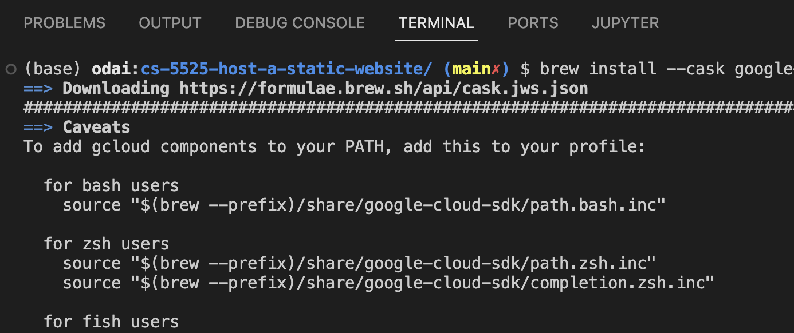
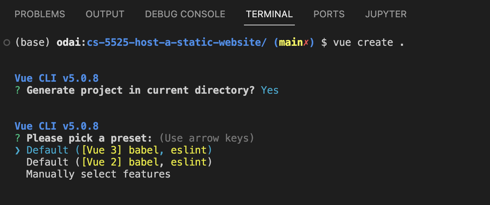
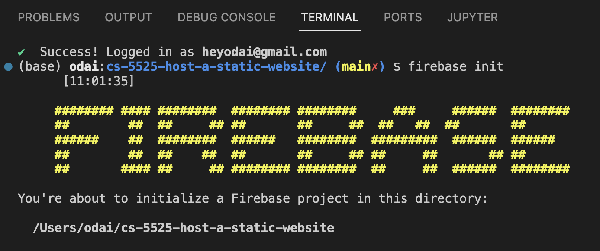

# CS5525: Hosting a Static Website

Odai Athamneh - 16293831

Per [the assignment](https://umsystem.instructure.com/courses/238738/assignments/2363628):

> Assignment 1: Host a static website (you can get lots of sample templates online) on the Google Cloud (you can choose another cloud platform if you have an account and credit), write the steps with the activity screenshot, and submit it as a report.
> 
> In addition, please share the link in the report so we can check the site.
> 
> Please keep in mind that it is not a group assignment. You have to do it yourself. Thanks, and all the best.

This Jupyter notebook contains the steps I took to complete the assignment. The static website is [available here](https://cs-5525-static-website.web.app/).


```python
import jupyter_toc # Humble brag: I wrote this

jupyter_toc.build('report.ipynb')
```


Table of Contents
- [CS5525: Hosting a Static Website](#cs5525:-hosting-a-static-website)
    - [Step 1. Environment Setup](##step-1.-environment-setup)
    - [Step 2. Create a Vue Project](##step-2.-create-a-vue-project)
    - [Step 3. Build and Deploy](##step-3.-build-and-deploy)
    - [Step 4. Submit the Report](##step-4.-submit-the-report)


## Step 1. Environment Setup


```python
# Install dependencies
!npm install -g @vue/cli
!npm install -g firebase-tools
!brew install --cask google-cloud-sdk
!brew install firebase-cli
```



## Step 2. Create a Vue Project


```python
!vue create . # Create Vue project
!vue add vuetify # Add Vuetify to Vue project
```



## Step 3. Build and Deploy


```python
!npm run build # Build Vue project in `/dist` directory
!gcloud init # Initialize Google Cloud SDK

# Deploy to Firebase
!firebase login
!firebase init
!firebase deploy
```



## Step 4. Submit the Report


```python
!jupyter nbconvert --to pdf report.ipynb # Convert Jupyter notebook to PDF for submission
```

    [NbConvertApp] Converting notebook report.ipynb to pdf
    [NbConvertApp] Writing 23789 bytes to notebook.tex
    [NbConvertApp] Building PDF
    [NbConvertApp] Running xelatex 3 times: ['xelatex', 'notebook.tex', '-quiet']
    [NbConvertApp] Running bibtex 1 time: ['bibtex', 'notebook']
    [NbConvertApp] WARNING | bibtex had problems, most likely because there were no citations
    [NbConvertApp] PDF successfully created
    [NbConvertApp] Writing 34214 bytes to report.pdf

